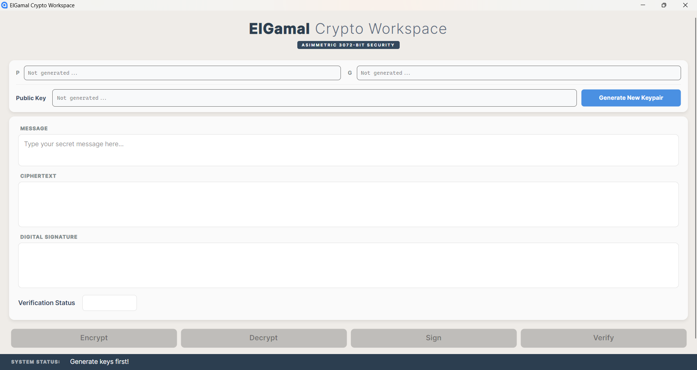
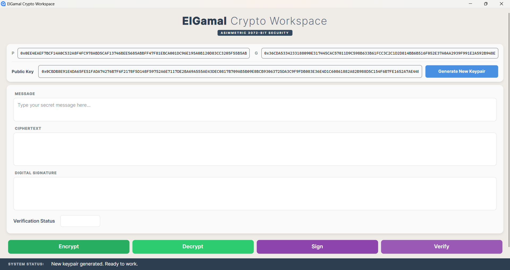
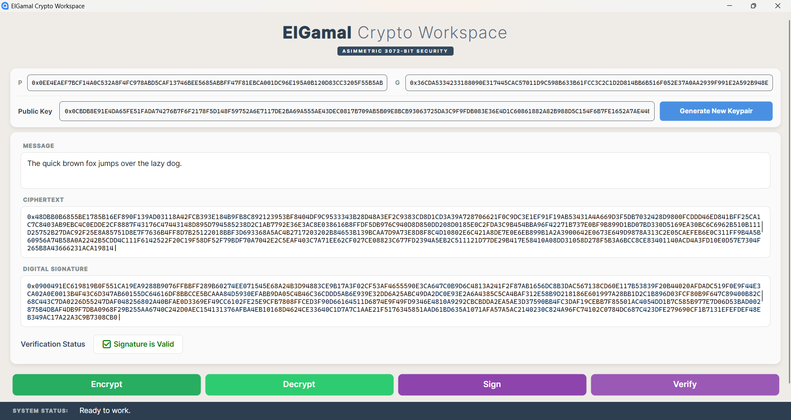
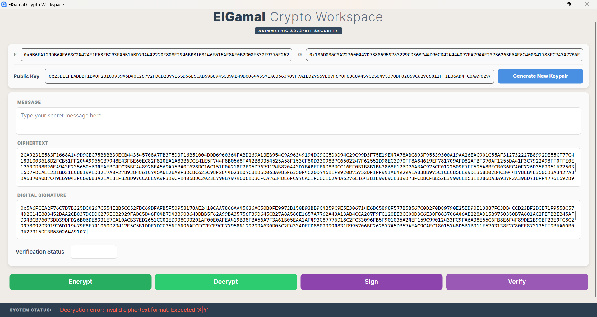
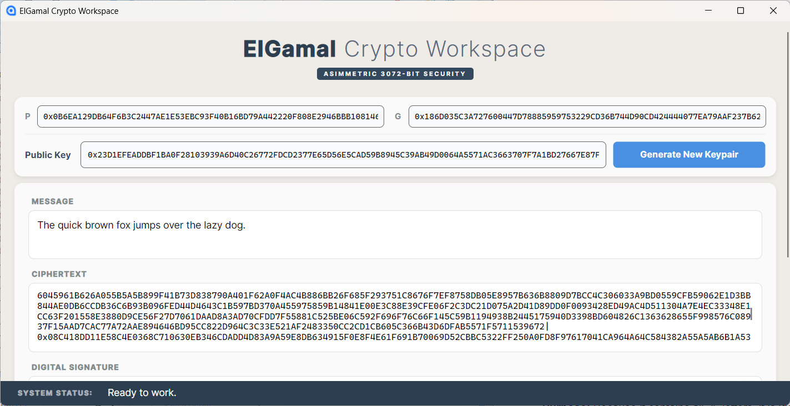
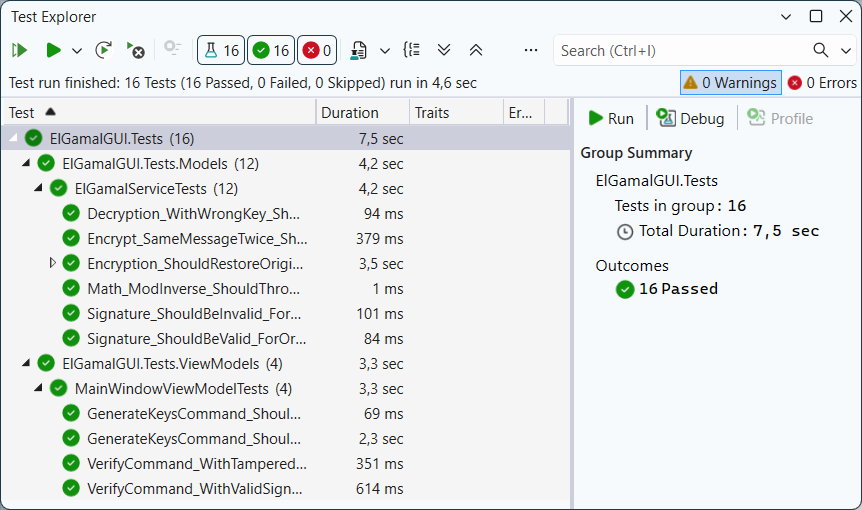

# ElGamal Crypto Workspace

[](https://opensource.org/licenses/MIT)
[](https://docs.microsoft.com/en-us/dotnet/csharp/)
[](https://dotnet.microsoft.com/download)
[](https://avaloniaui.net/)
[](https://learn.microsoft.com/en-us/dotnet/architecture/maui/mvvm)
[]()

A modern, high-security desktop application built with **Avalonia UI** that demonstrates the implementation of the **ElGamal Cryptosystem**. This workspace provides a full suite of tools for asymmetric encryption, decryption, and digital signatures using **3072-bit keys**.

## ⚡ Features

- **Asymmetric Key Generation**: Generates cryptographically secure 3072-bit `P` and `G` parameters along with **Public** and **Private** keypairs.
- **Data Encryption/Decryption**: Securely encrypt and decrypt messages using the ElGamal algorithm.
- **Digital Signatures**: Sign messages to ensure integrity and verify them using the sender's **Public Key**.
- **Responsive UI**: A "pixel-perfect" interface that adapts to various window sizes with built-in scroll support and fixed status tracking.
- **Real-time Validation**: Visual feedback for signature verification and system operations.

## 🛠 Technical Stack

- **Framework**: [Avalonia UI 11](https://avaloniaui.net/) — A powerful, cross-platform XAML-based UI framework.
- **Runtime**: [.NET 10](https://dotnet.microsoft.com/en-us/download) — Using the cutting-edge features of the latest .NET platform.
- **Language**: C# 13 — Leveraging modern syntax and high-performance features.
- **MVVM Libraries**:
  - [CommunityToolkit.Mvvm](https://learn.microsoft.com/en-us/dotnet/communitytoolkit/mvvm/) — For robust, source-generated ViewModels.
  - [ReactiveUI](https://www.reactiveui.net/) — For reactive property handling and advanced UI logic.
- **Security**: 3072-bit Prime numbers for NIST-compliant asymmetric security (Discrete Logarithm Problem).

## 📸 Interface Preview

The application is designed with a clear logical flow, divided into three functional zones:
1. **Key Management**: Secure generation and display of `P`, `G`, and **Public Key** parameters.
2. **Workspace**: Dedicated interactive areas for plaintext messages, hex-encoded ciphertext, and digital signatures.
3. **Control Center**: Intuitive action buttons coupled with a real-time system status and validation bar.

### User Journey in Screenshots

**01. Default State**. The initial clean slate of the application upon startup.



**02. Key Generation & Setup**. Dynamic generation of 3072-bit cryptographic parameters (`P`, `G`, and **Public Key**).



**03. Encryption & Signing**. Full cryptographic cycle showing secure messaging with active signature verification.



**04. Error Handling**. Real-time feedback and validation for incorrect inputs or decryption errors.



**05. Responsive Design**. Adaptive UI layout ensuring usability even when the window is resized.



## 📋 How to Use

1. 🔑 **Generate Keys**: Click the **"Generate New Keypair"** button. This establishes the mathematical foundation for your session.
2. 🔒 **Encrypt**: Type a message in the _Message_ box and click **"Encrypt"**. The _Ciphertext_ will appear below.
3. ✍️ **Sign**: Click **"Sign"** to create a unique digital signature based on your message and **Private Key**.
4. ✅ **Verify**: Click **"Verify"** to check if the signature matches the message and the current **Public Key**. A green **"Signature is Valid"** badge will appear upon success.

## 🧪 Testing & Quality Assurance

To ensure the highest level of cryptographic reliability, the project includes a comprehensive test suite powered by **xUnit**.

### Key Test Categories:
- **Algorithm Verification**: Tests the mathematical correctness of the ElGamal implementation, including encryption/decryption cycles and signature validity.
- **Probabilistic Encryption**: Verifies that encrypting the same message twice produces different ciphertexts (semantic security).
- **Edge Case Handling**: Validates system behavior with Unicode (Emoji, Cyrillic), empty strings, and large data blocks.
- **UI State Logic**: Ensures the ViewModel correctly resets fields upon key regeneration and provides accurate real-time feedback.
 


> **Note**: For performance during testing, the Test Suite uses 512-bit keys, while the production application defaults to 3072-bit keys.

## 🔐 Cryptography Note

The ElGamal scheme implemented here relies on the **Discrete Logarithm Problem**. Encryption follows the formula:

$$c_1 = g^k \pmod p$$
$$c_2 = (m \cdot y^k) \pmod p$$

Where $y$ is the public key and $k$ is a random ephemeral key.

## 📂 Project Structure

```
├── assets/                              # Documentation screenshots
├── src/ElGamalGUI/                      # Main Avalonia Application
│   ├── Converters/                      # UI Value converters (Status to Color)
│   ├── Models/                          # Cryptographic core & Interfaces
│   ├── ViewModels/                      # UI Logic & Reactive commands
│   └── Views/                           # XAML Layouts & Styling
├──tests/ElGamalGUI.Tests/               # xUnit Test Suite    
│   ├── Models/                          # Math & Algorithm verification
│   └── ViewModels/                      # UI behavior & State tests
└── ElGamal-Avalonia-Visualize.slnx      # Solution file
```

## 🚀 Installation

1. Clone the repository:
```bash
git clone https://github.com/AnastasiaZAYU/elgamal-avalonia-visualize.git
```
2. Open `ElGamal-Avalonia-Visualize.slnx` in **[Visual Studio](https://visualstudio.microsoft.com/)** (2022 or newer).
3. Build and run the project (F5).

## 📄 License

This project is licensed under the MIT License - see the [LICENSE](LICENSE) file for details.


